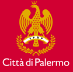

####################
Regolamento per il funzionamento del servizio Ufficio Relazioni con il Pubblico (URP) del Comune di Palermo.
####################

Fonte del `Regolamento comunale <https://www.comune.palermo.it/js/server/normative/_24122012094310.pdf>`_, approvato con Deliberazione di Consiglio Comunale n. 335 del 17/09/2008 (*REGOLAMENTO PER IL FUNZIONAMENTO DEL SERVIZIO UFFICIO RELAZIONI CON IL PUBBLICO*).

Portale dell'`Ufficio Relazioni con il Pubblico <https://www.comune.palermo.it/urp.php>`_ del Comune di Palermo.

.. figure:: img/ccbysa.png

Quest'opera è distribuita con `Licenza CC BY SA 4.0 <https://creativecommons.org/licenses/by-sa/4.0/deed.it>`_ - Creative Commons,  Attribuzione, Condividi allo stesso modo, versione 4.0 Internazionale.

|

Testo del Regolamento 
==========================

.. toctree::

   _docs/capo1.rst
   _docs/capo2.rst
   _docs/capo3.rst
   _docs/capo4.rst
   _docs/capo5.rst
   _docs/capo6.rst
   _docs/capo7.rst
