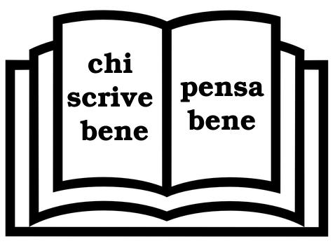
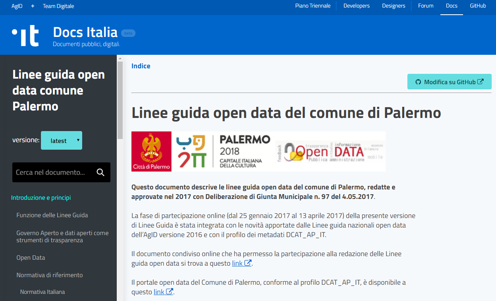

####################
Come abbiamo creato un "Read the Docs" per pubblicare documenti pubblici su Docs Italia
####################

Che cosa è questo tutorial
--------------------------

   immagine rilasciata con licenza CC0 

Questo tutorial ha l'obiettivo di spiegare due modalità per la creazione di  un Documento da visualizzare tramite la piattaforma `Read the Docs <http://readthedocs.io/>`_, secondo le specifiche della `Guida "Docs Italia" del Team Trasformazione Digitale dell'AgID (Agenzia per l'Italia Digitale) <http://guida-docs-italia.readthedocs.io/it/latest/>`_.

**Read The Docs** è un servizio online gratuito che semplifica la gestione della documentazione relativa ad una pubblicazione, e consente di automatizzare:

- la creazione dei documenti, 

- il controllo delle versioni della pubblicazione che possono essere aggiornate nel tempo,

- l'hosting dei singoli documenti pubblicati.

   immagine dell'home page delle `Linee guida open data del Comune di Palermo realizzate su Read the Docs <http://linee-guida-open-data-comune-palermo.readthedocs.io/it/latest/>`_

|

A chi si rivolge il tutorial
----------------------------

Il tutorial si rivolge principalmente ai dipendenti e dirigenti di ogni tipologia di Pubblica Amministrazione in Italia, soprattutto a chi è responsabile della pubblicazione di documenti pubblici online, regolamenti, manuali e a chi si occupa di comunicazione istituzionale. 

Non è necessario essere sviluppatori per usare le procedure che spieghiamo in questo tutorial e infatti abbiamo strutturato questo documento in più parti:

.. important:: 

   - una destinata a chi non è molto addentro ai linguaggi di programmazione e ai sistemi di versionamento (curata da Ciro Spataro) = **il capitolo 1**; 
   - un’altra per chi ha maggiori competenze digitali (a cura di Pablo Persico) = **il capitolo 3**;
   - infine una in comune alle precedenti, abbastanza semplice, che consiste nella creazione del nome del progetto da pubblicare sulla piattaforma di Read the Docs, che si svolge solo dopo aver terminato la compilazione del progetto su Github = **il capitolo 2**.

Ciro Spataro e Pablo Persico hanno seguito due strade diverse (capitolo 1 e capitolo 3) per raggiungere lo stesso obiettivo di pubblicazione di documenti su Read the Docs.
In tal manera verrà coperta un'ampia rappresentanza (in fatto di competenze digitali) dei dipendenti e dirigenti pubblici. 

|

Un tutorial a cura di
----------------------

.. sidebar:: questo tutorial vuole essere
   
   un lavoro integrativo a quello svolto dal Team con la `Guida "Docs Italia" <http://guida-docs-italia.readthedocs.io/it/latest/>`_. Un esperimento per attuare i contenuti della Guida e verificare passo passo le procedure indicate.

- Ciro Spataro (Comune di Palermo, OpenDataSicilia), email: c.spataro@comune.palermo.it 
- Pablo Persico (Città Metropolitana di Napoli, OpenDataSicilia), email: ppersico@cittametropolitana.na.it
- Andrea Borruso (OnData, OpenDataSicilia), supervisione e "spingitore di tutorial", email: andrea.borruso@ondata.it

.. figure:: img/ods-small.png

|

Perché questo tutorial
-----------------------

Il Team Trasformazione Digitale dell'AGID ha creato `"Guida a Docs Italia" <http://guida-docs-italia.readthedocs.io/it/latest/>`_ per consentire e agevolare le pubbliche amministrazioni ad usare il format di "Read The Docs" al fine di pubblicare atti, documenti del tipo: Decreti, Norme, Regolamenti, Linee Guida, Piani, Deliberazioni, Determinazioni, ecc. 

Dopo questo lavoro del Team Trasformazione Digitale, siamo partiti in `3 Pubbliche Amministrazioni a creare documenti su Read the Docs <http://bit.do/readthedocs-entipubblici>`_ e siamo sicuri che questo formato sarà adottato da tanti altri soggetti che lavorano in altre PA. Vogliamo fare da apripista, stimolo e anche supporto. Siamo a disposizione per aiutarvi, con piacere,  partendo proprio da questo tutorial.

.. admonition:: OBIETTIVO

   **L'obiettivo prioritario** è far in modo da diminuire le pubblicazioni online in formato PDF, che oggi rappresenta il formato più usato nei siti web della PA, ma che non consente una leggibilità nei dispositivi mobili (viene molto difficile e non è affatto pratico) e che non permette un’agevole ricerca di parole nel testo. Il formato Read the Docs, invece, soddisfa i suddetti requisiti. 

.. admonition:: DAL READ THE DOCS ALTRI FORMATI

   Dal formato Read the Docs è possibile convertire, in maniera instantanea, il documento nei formati **PDF**, **HTML** ed `EPUB <https://it.wikipedia.org/wiki/EPub>`_ (che è *uno standard aperto specifico per la pubblicazione di libri digitali -eBook- basato su* `XML <https://it.wikipedia.org/wiki/XML>`_).

Inoltre usare "Read the Docs" consente un facile riuso dei contenuti da parte della società e di quelle pubbliche amministrazioni che  manifestano interesse a questo formato di pubblicazione.

|

Un tutorial di sperimentazione
------------------------------

Questo lavoro vuole essere soprattutto sperimentazione sulle modalità con le quali si fanno cose negli uffici pubblici, pensando a  migliorare la fruizione dei documenti online. 

Un punto di partenza **aperto a contributi esterni**, un documento che possa svilupparsi anche grazie alle esperienze di soggetti di altre PA che vorranno adottare Read The Docs come strumento per diffondere cultura della documentazione della PA anche con finalità di riutilizzo e condivisione. 
Per questo motivo ad ogni pagina del tutorial abbiamo pensato di inserire una sezione per riveceve i commenti, grazie all'uso del servizio fornito da `Disqus <https://disqus.com/>`_. 

|

Attività propedeutica alla pubblicazione su Read the Docs
----------------------------------------------

- avere un account `GitHub <https://github.com>`_;
- avere un account `Read the Docs <https://readthedocs.org/>`_.

La `Guida di Docs italia <http://guida-docs-italia.readthedocs.io/it/latest/index/come-partecipare.html#organizzazione-su-github>`_ consiglia la creazione di una organizzazione su GitHub. 

|

Licenza
-------

Quest'opera è distribuita con `Licenza CC BY SA 4.0 <https://creativecommons.org/licenses/by-sa/4.0/deed.it>`_ - Creative Commons,  Attribuzione, Condividi allo stesso modo, Versione 4.0 Internazionale.

------

|

Contenuti del Tutorial 
==========================

.. toctree::

   _docs/capitolo1.rst
   _docs/capitolo2.rst
   _docs/capitolo3.rst

.. raw:: html
   :file: disqus.html
