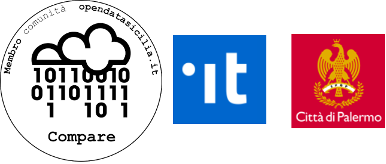

####################
Linee guida open data del comune di Palermo
####################

.. figure:: img/opendata.png

**Questo documento descrive le linee guida open data del comune di Palermo, redatte e approvate nel 2017**.

La fase di partecipazione (dal 25 gennaio 2017 al 13 aprile 2017) della presente versione di Linee Guida è stata integrata con le novità apportate dalle linee guida nazionali open data dell’Agid versione 2016 (AgID) e con il profilo dei metadati DCAT_AP_IT (AgID).

Quest'opera è distribuita con **Licenza CC BY SA 4.0** - Creative Commons Attribuzione - Condividi allo stesso modo 4.0 Internazionale.

------

**INTRODUZIONE E PRINCIPI**

Funzione delle Linee Guida

Governo Aperto e dati aperti come strumenti di trasparenza

Open Data

Normativa di riferimento

**ORGANIZZAZIONE DEL COMUNE PER LE ATTIVITÀ SUGLI OPEN DATA**

Strutturazione interna

Modello Operativo

Formazione

Partecipazione sociale nel processo degli Open Data comunali

Attività di monitoraggio e ruolo degli indicatori

Piattaforma web per la pubblicazione degli open data del comune di Palermo

**PROCESSO DI PUBBLICAZIONE DEGLI OPEN DATA**

Metodologia per la pubblicazione dei dati in formato open 

Modalità di individuazione (e selezione) dei dati da pubblicare in formato open

Modalità di produzione dei dataset e formato di pubblicazione

Modalità di produzione dei dataset dalle piattaforme ICT del PON METRO Palermo

I Metadati

Modello di dati per i dati aperti 

I livelli del modello per i metadati

Licenza per il riutilizzo

Frequenza di aggiornamento

Modalità di pubblicazione dei dataset sul sito web

Comunicazione e promozione dei dataset pubblicati

**RIUTILIZZO DEGLI OPEN DATA**

Modalità di riutilizzo dei dati pubblicati e richiesta di pubblicazione di nuovi dati

Commenti, suggerimenti e segnalazioni sui dataset pubblicati

Utilizzo da parte del Comune di applicazioni e interfacce sviluppate da terzi

**OBIETTIVI, AZIONI E TEMPI**

**APPENDICE A: DEFINIZIONI**

**APPENDICE B: CATALOGAZIONE DEI SET DI DATI CON IL METODO DELLE STELLE**

**APPENDICE C: SCHEDA CATALOGAZIONE DATASET ED ESEMPI**

**NOTA FINALE**

**RIFERIMENTI BIBLIOGRAFICI**

**CREDITI**

.. toctree::

   _docs/Introduzione_e_principi.rst
   _docs/Organizzazione_del_comune_per_le_attivita_sugli_open_data.rst
   _docs/Processi_di_pubblicazione_sugli_open_data

